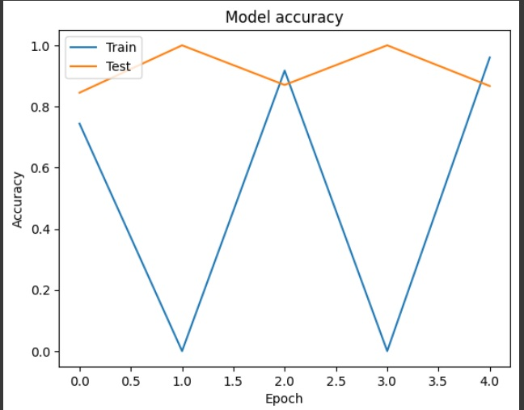
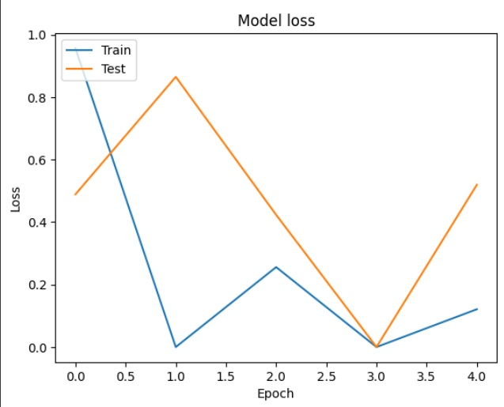

# 🌿 Plant Disease Detection Using CNN

## 📌 Overview

This project implements a Convolutional Neural Network (CNN) model to detect plant diseases from leaf images. Utilizing the PlantVillage dataset, the model classifies images into various disease categories, aiding in early detection and management of plant health issues.

## 🧠 Model Architecture

The CNN model comprises the following layers:

- **Convolutional Layers**: 2 layers for feature extraction
- **MaxPooling Layers**: 2 layers for dimensionality reduction
- **Fully Connected Layer**: 1 layer for classification

*Model Architecture Visualization:*


## 📊 Training Metrics

- **Accuracy**:

  
- **Loss**:

  

These graphs illustrate the model's performance over training epochs.

## 🗂️ Dataset

The model is trained on the [PlantVillage Dataset](https://www.kaggle.com/datasets/abdallahalidev/plantvillage-dataset), which contains a diverse set of labeled plant leaf images.

## 🚀 Getting Started

### Prerequisites

- Python 3.x
- Jupyter Notebook
- Kaggle API Token (for dataset access)

### Installation

1. **Clone the Repository:**

   ```bash
   git clone https://github.com/DalMakkhani/PlantDiseaseDetection.git
   cd PlantDiseaseDetection
   ```
   
2. **Install Dependencies**
   Install required python packages

   ```bash
   pip install -r requirements.txt
   ```
   
3. **Obtain Kaggle API token**
     Sign in to your Kaggle account.
     Navigate to your account settings and select "Create New API Token."
     Download the kaggle.json file and place it in the appropriate directory.
   
5. **Download the Dataset:**
    Use the Kaggle API to download the dataset:
    ```bash
    kaggle datasets download -d abdallahalidev/plantvillage-dataset
    unzip plantvillage-dataset.zip -d dataset
    ```

6. **Run the Notebook**
    Open the Jupyter Notebook and execute the cells:
    ```bash
    jupyter notebook Plant_Disease_Prediction_CNN_Image_Classifier.ipynb
    ```

## 🔍 Usage
**Training the Model:**

Execute the notebook cells to train the CNN model on the PlantVillage dataset.

**Evaluating Performance:**

Review the accuracy and loss graphs to assess model performance.

**Making Predictions:**

Use the trained model to predict diseases from new leaf images.

## 🛠️ Future Enhancements
**Model Optimization:**

Implement data augmentation techniques to improve model generalization.

Experiment with deeper architectures or transfer learning for enhanced accuracy.

**Web Application:**

Develop a user-friendly web interface for real-time disease prediction.

**Mobile Deployment:**

Optimize the model for deployment on mobile devices for field usage.
